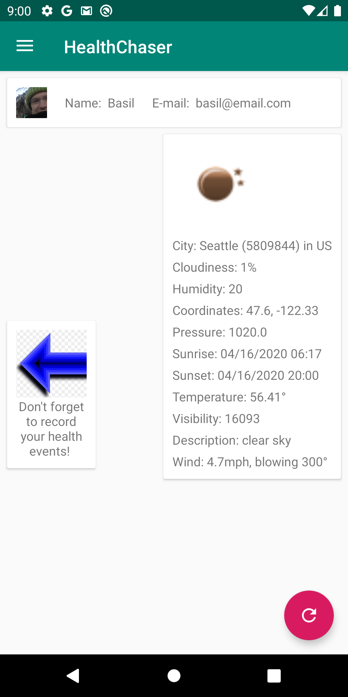
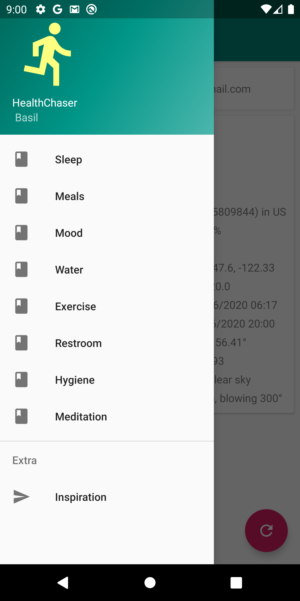
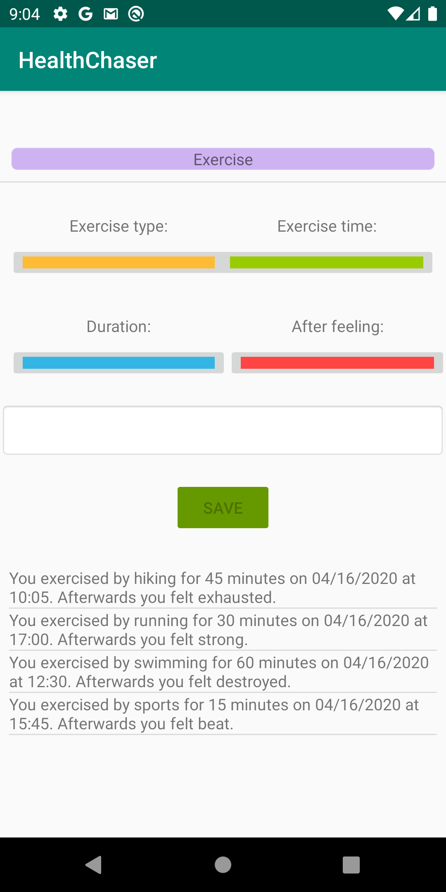
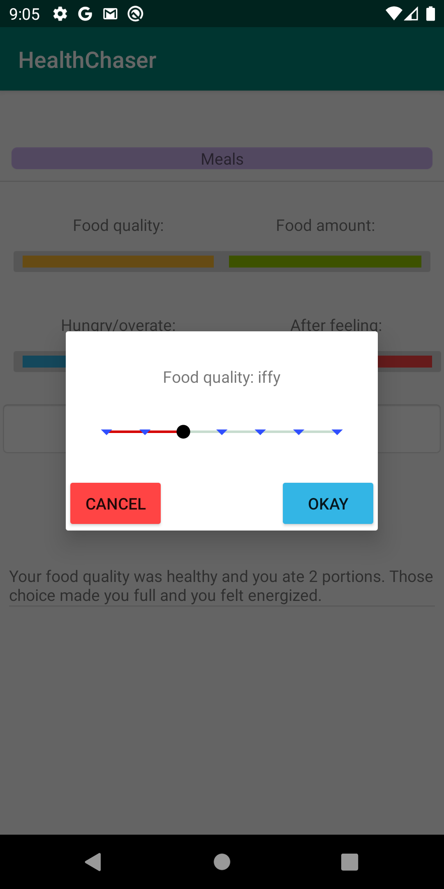
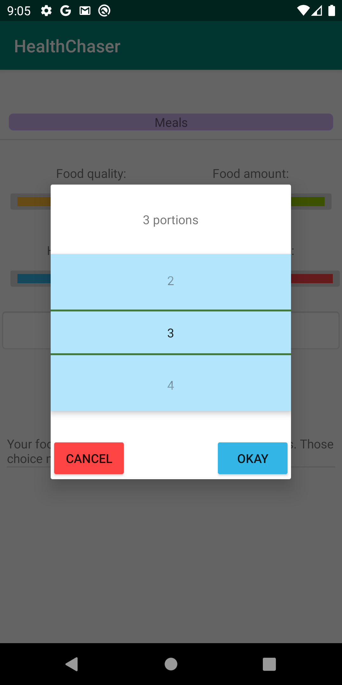
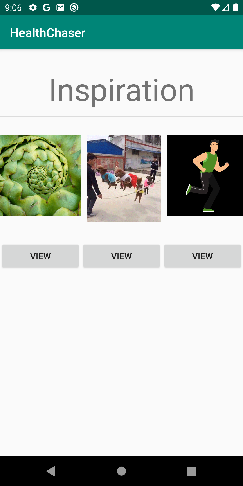

# HealthChaser
Record data points which coalesce into an integrative whole in order to chase the goal of optimum health.

## Description
Track your daily activities by recording the time, duration, and the effects. Categories include exercise, hygiene, meals, meditation, mood, restroom, sleep, and water consumption. Data is stored in a realtime database using Firebase. An inspirational screen of gifs and the current weather can act as extra incentives to stay on track.

## Features
Android application coded in Java. Multiple activities, dialog fragments, views, Google login, Live Data, recycler views, View Flipper, REST API, Firebase, GPS, AnimatedImageDrawable, and sound effects.

## Screenshots
&nbsp;&nbsp;&nbsp;&nbsp;&nbsp;&nbsp;&nbsp;&nbsp;&nbsp;&nbsp;&nbsp;&nbsp;&nbsp;&nbsp;&nbsp;&nbsp;&nbsp;&nbsp;&nbsp;&nbsp;&nbsp;&nbsp;&nbsp;&nbsp;
